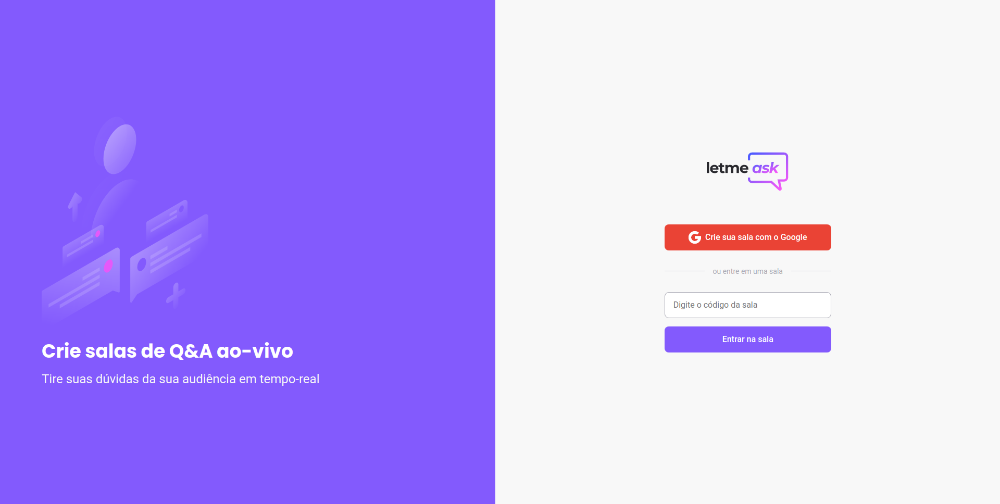

    

    

 
 

# 👨‍💻 Tecnologias
Esse projeto foi desenvolido com as seguintes tecnologias
<ul>
    <li><a href="https://reactjs.org" rel="nofollow">React</a></li>
    <li><a href="https://firebase.google.com/" rel="nofollow">Firebase</a></li>
    <li><a href="https://www.typescriptlang.org/" rel="nofollow">TypeScript</a></li>
    <li><a href="https://eslint.org/" rel="nofollow">Eslint</a></li>
    <li><a href="https://prettier.io/" rel="nofollow">Prettier</a></li>
</ul>
 

# 🚀 Como executar
Clone o projeto e acesse a pasta do mesmo.

    $ git clone https://github.com/rocketseat-education/nlw-06-reactjs
    $ cd nlw-06-reactjs

Para iniciá-lo, siga os passos abaixo:

# Instalar as dependências
    $ yarn

# Iniciar o projeto
    $ yarn start
O app estará disponível no seu browser pelo endereço http://localhost:3000.

Lembrando que será necessário criar uma conta no Firebase e um projeto para disponibilizar um Realtime Database.

Feito com 💙 by s4mukka
